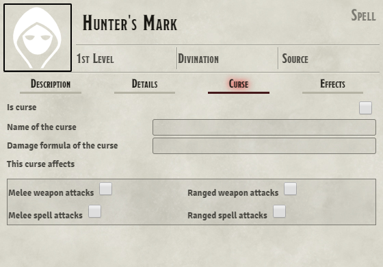
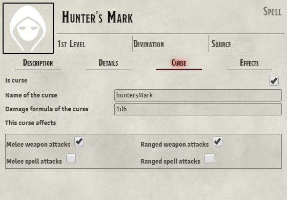
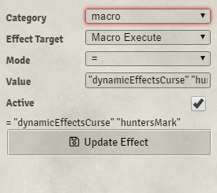

# Better Curses
Better Curses module for Foundry VTT

## Features

This module for the DND5e system exists to make it easier to run games where someone has a persistent effect that deals damage when hit with an attack, such as [Hunter's Mark](https://www.dndbeyond.com/spells/hunters-mark) or Hex.

To begin, select the item that can afflict the curse. For the purpose of example, Hunter's Mark will be used.

### Setting up the Curse item

Edit the Item and go to the "Curse" tab.

From here you can define whether the item is a curse, and give it a unique name. This name cannot have spaces, as the damage calculations rely on Roll's `_replaceData` function, which also cannot have spaces. You can also define what type of attacks trigger the curse.
Hunter's Mark deals 1d6 damage when hit with a weapon attack, so:

### Applying the Curse

To apply a curse to a target, run the script `BetterCurses.curse([Curse Name as defined above])` while having the curser selected, and the target targeted.
The module comes with a compendium pack with two macros, one simply setting a variable space for you to apply the curse.

#### Dynamic Effects curse application

The other macro is `dynamicEffectsCurse`, which can reduce the number of macros you need to keep saved. If you wish to use this method, set the active effect of the item to be `Macro Execute = "dynamicEffectsCurse" "[Curse Name as defined above]"`. Then simply activate the item to apply the curse.

#### Removing the curse

If you attempt to apply the curse to a target when they are already cursed by that actor, then it will remove the curse for that target from that curser.

## Installation

Install using the manifest URL: `https://raw.githubusercontent.com/Wigsinator/betterCurses/master/src/module.json`

## List of functionality to create

- [ ] Make it easier to know who is cursed, and by whom
- [ ] Add a function to clear all curses affecting a target
- [ ] Alter targeting rules so that curses can only target one user
- [ ] Set other persistent effects, such as disadvantage on ability checks
